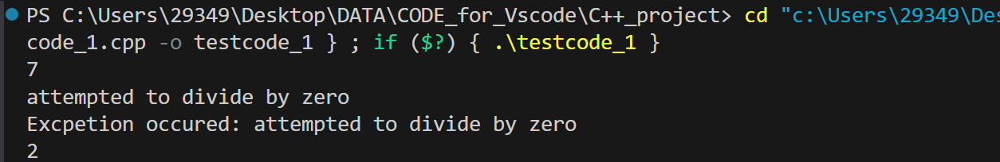

<style>
  html, body, .markdown-body {
    font-family: Georgia, sans, serif;
  }
</style>

# C++ Primer Plus Tutorial-15

<center><p style="color: red;"><b><font size=6.5>Chapter 15 Exception Handling</font></b></p></center>

<center><p style="color: red;"><b><font size=6.5>C++中的异常处理</font></b></p></center>

【写在前面的话】

[C++ Primer Plus Tutorial](https://xiyuanyang-code.github.io/posts/C-Primer-Plus-tutorial/)

## Abstract

> 在原书的15.1节介绍了友元类函数的高阶用法，包括其他友元关系和共同友元。
>
> 在原书的15.2节介绍了嵌套类的高级用法。
>
> 对于刚刚入门C++的本科生而言，这两部分内容笔者在此不展开叙述。下面，我们将重点放在C++的一个功能强大的模块，也是“++”的部分——**C++的异常处理机制**。

This article mainly introduces the exception handling mechanism introduced in C++, which includes `throw` (throwing exceptions), `try` (exception handling), and `catch` (catching exceptions), as well as some advanced techniques for exception handling.

## Introduction

在程序设计中，有时会遇到**程序异常终止**的情景，例如用户进行了非法输入导致数据无法正常读取，尝试打开一个不可用的文件，对内存管理不当（申请过多的内存，内存泄漏）等等。而C++中的异常处理（Exception Handling）提供了一种机制，使程序在运行时能够**优雅**地处理错误。通过异常处理，程序可以检测并响应不同类型的运行时错误，而**无需中断正常的程序流程**。C++中的异常处理包括三个基本部分：**throw**、**try** 和 **catch**。

> 何为**优雅**？异常处理使程序能够在遇到错误时跳转到适当的错误处理代码，程序的控制流不会直接终止而是转移到专门用来处理异常的地方。但是如果不使用异常处理，程序会直接崩溃或者挂起。

请看下面的示例程序：

```C++
#include <iostream>
using namespace std;

int main(){
    int a=2;
    int b[]={5,4,3,2,1,0};
    for(auto num:b){
        cout<<double(a)/num<<endl;
    }
    return 0;
}
```

输出示例：

```
0.4
0.5
0.666667
1
2
inf
```

程序在num的值（分母）为0是输出了`inf`，这是一个表示无穷大的特殊浮点数值。

幸运的是，在此处程序不会异常终止，但是一旦`inf`会被用在后续的复杂的程序计算中，便会产生非常严重的后果，也为后续的Debug过程增加了负担。因此，我们不得不引入一种**异常处理的机制**，来专门用来处理给种各样的异常情况，使我们的程序更加的鲁棒。

## If No Exception Handling？

接下来我们来介绍两种**不需要使用异常处理机制的方法来终止程序**。

### Abort

`abort()` 函数是 C/C++ 中用于终止程序执行的一个标准库函数。它通常用于程序遇到严重错误时，强制终止程序并产生异常的退出状态。该函数会立即停止程序的执行，并且不会进行任何清理操作（如调用析构函数或执行 `atexit()` 注册的函数等）。

```C++
#include <iostream>
#include <cstdlib>  // 包含 abort 函数

int main() {
    std::cout << "Program started." << std::endl;

    // 由于某种条件不满足，调用 abort 终止程序
    std::cout << "An error occurred, aborting program." << std::endl;
    abort();  // 强制终止程序

    // 这行代码不会被执行
    std::cout << "This will not be printed." << std::endl;

    return 0;
}

```

严格来说，这并不能能算一种异常处理的机制，毕竟没有人想通过**强制退出**的方法终止自己的程序。（而且这会带来非常多的隐患，例如**动态分配的内存没有被清除等**）


### 使用函数的返回值

一种比异常终止更灵活的方法是，使用函数的返回值来指出问题。例如， `ostream` 类的 get（ void）成员通常返回下一个输入字符的 ASCII 码，但到达文件尾时，将返回特殊值 EOF。对 hmean( )来说，这种方法不管用。任何数值都是有效的返回值，因此不存在可用于指出问题的特殊值。在这种情况下，可使用指针参数或引用参数来将值返回给调用程序，并使用函数的返回值来指出成功还是失败。**istream 族重载>>运算符使用了这种技术的变体。通过告知调用程序是成功了还是失败了**，使得程序可以采取除异常终止程序之外的其他措施。程序清单 15.8 是一个采用这种方式的示例，它将 hmean( )的返回值重新定义为 bool，让返回值指出成功了还是失败了，另外还给该函数增加了第三个参数，用于提供答案。  

> 通俗来说，在流输入的时候，如果进行非法输入会直接告知调用程序是否调用成功，这也就是为什么我们可以使用`while(cin>>a)`的结构。

```C++
//error2.cpp -- returning an error code
#include <iostream>
#include <cfloat>  // (or float.h) for DBL_MAX

bool hmean(double a, double b, double * ans);

int main()
{
    double x, y, z;

    std::cout << "Enter two numbers: ";
    while (std::cin >> x >> y)
    {
        if (hmean(x,y,&z))
            //这里将函数的返回值设置为布尔值，用来判断条件是否成立，而将运算的结果通过指针的方式储存。
            std::cout << "Harmonic mean of " << x << " and " << y
                << " is " << z << std::endl;
        else
            std::cout << "One value should not be the negative "
                << "of the other - try again.\n";
        std::cout << "Enter next set of numbers <q to quit>: ";
    }
    std::cout << "Bye!\n";
    return 0;
}

bool hmean(double a, double b, double * ans)
{
    if (a == -b)
    {
        *ans = DBL_MAX;
        return false;
    }
    else
    {
        *ans = 2.0 * a * b / (a + b);
        return true;
    }
}

```

## Exception Handling

首先解决第一个问题，上文两种异常处理的方法有什么局限性？

`Abort()`不必多说，没有程序员希望在程序中使用这个丑陋的东西，那`返回值`呢？这确实是一种方法，但这种方法的本质还是**if-else大法进行分类讨论**，如果判断错误的情况就进行特殊的处理，会增加程序的复杂性。（你也不希望自己的程序满眼望过去全是用来if-else处理异常情况的代码块吧）

不过值得庆幸的时，第二种方法给了我们一种思路，即**异常处理可以跳转程序的控制流到一个特殊的地方，在那个地方我们专门来处理错误**，这样即可以保证程序的控制流不会**异常中断（像`abort()`一样）**，也无需使用if-else大法，是程序更加的简洁。

这就是异常处理的最基本思路：**提供了一种将程序的控制权从一个部分传递到另一个部分的途径**。



从另一个角度来说，异常处理就像是一个**踢皮球**的过程，矛盾上交，让函数在发现自己无法处理的错误时**抛出一个异常**，希望他的调用者能够处理这个问题，**将异常检测和异常处理分开，将异常处理和解决问题的主逻辑分开，更加的清晰**。



C++中的异常处理包括三个基本部分：**throw**、**try** 和 **catch**。

### 示例程序

1. **throw**：用于**抛出异常**。可以抛出任何类型的对象，通常是类的实例，但也可以是原始数据类型。
2. **try**：用来定义异常检测的代码块。try块中的代码会被执行，若出现异常，程序会跳转到相应的catch块处理异常。
3. **catch**：用于捕获和处理异常。每个catch块对应一个特定类型的异常，可以根据异常类型进行不同的处理。

```cpp
#include <iostream>
#include <stdexcept> // 引入标准异常头文件

// 一个简单的函数，用来演示异常处理
void divide(int a, int b) {
    if (b == 0) {
        // 抛出异常
        throw std::invalid_argument("Division by zero is not allowed");
    }
    std::cout << "Result: " << a / b << std::endl;
}

int main() {
    try {
        divide(10, 0);  // 这里会抛出异常
    } catch (const std::invalid_argument& e) {
        // 捕获并处理异常
        std::cout << "Error: " << e.what() << std::endl;
    }
    return 0;
}
```

输出：`Division by zero is not allowed`

> 如果将第15行代码修改为：`divide(10, 1);`输出：`Result: 10`

#### 代码解析

1. **throw std::invalid_argument("...")**：如果除数为0，抛出一个`std::invalid_argument`类型的异常，带有错误信息。
2. **try-catch**：在`main()`函数中，调用`divide()`时使用了`try`块，如果发生异常（例如除数为0），会跳转到相应的`catch`块处理异常。
3. **catch (const std::invalid_argument& e)**：捕获异常并处理，`e.what()`返回异常的详细信息。

## Throw 异常抛出

如果程序发生了异常，程序希望将错误信息发送到更大的环境中。（转移程序的控制权）这就是**throw**语句（异常抛出语句），它的功能将一个**操作数**抛出到“更大的环境”（即**跳出当前的程序块**）

还是以除数不可以为0为例：

```C++
#include <iostream>
using namespace std;

int divv(int x,int y){
    if(y==0){
        throw(y);
    }
    return x/y;
}
int main(){
    cout<<divv(1,2)<<endl;
    cout<<divv(1,0);
    cout<<divv(0,3)<<endl;
    return 0;
}
```

输出结果：


很不幸的是，这里程序仍然是异常终止的，程序的控制流被直接切断，我们想要程序执行的第三条语句 `cout<<divv(0,3)<<endl`并没有执行。因为throw只是**抛出了一个异常**，我们并没有定义对所抛出异常的后续处理方法。Anyway，我们成功迈出了异常处理的第一步！

在这个程序中，**操作数**就是被抛出的int值`y`。异常抛出语句的一般形式为`throw <操作数>`。**throw对应的操作数可以是任何类型，可以是基本的数据类型，也可以是自定义的类和对象（异常对象）**。下面我们来看一个如何自定义一个异常类和异常对象。

```C++

#include <iostream>
using namespace std;
class Divide_by_zero{
    public:
        Divide_by_zero():message("attempted to divide by zero"){
            cout<<message<<endl;
        }
        //构造函数
        const char* what() const {
            return message;
        }
        //what方法来调用私有数据成员message
    private:
        const char* message;
};
int divv(int x,int y){
    if(y==0){
        throw Divide_by_zero();
    }
    return x/y;
}
int main(){
    cout<<divv(14,2)<<endl;
    cout<<divv(1,0);
    cout<<divv(6,3)<<endl;
    return 0;
}
```

```
输出示例：
7
attempted to divide by zero
terminate called after throwing an instance of 'Divide_by_zero'
```

在输出中，出现了`message`的内容，说明语句 `throw Divide_by_zero()`首先创建了一个`throw Divide_by_zero()`类的临时对象，调用了其构造函数，然后抛出这个临时对象（输出的第三行）。

> 这里没有构造显式的析构函数，因为默认的析构函数就会销毁成员message。

## Try-Catch 异常捕获

### 异常抛出后的控制权问题

在上文我们知道，**程序在异常处理后需要被捕获**。何为捕获？在开始这一部分内容之前，我们首先介绍一下**在抛出异常的时候，程序的控制权发生了什么。**

```C++
#include <iostream>
#include <stdexcept> // std::runtime_error

// 函数A抛出异常
void functionA() {
    std::cout << "Inside functionA\n";
    throw std::runtime_error("An error occurred in functionA");
}

// 函数B调用函数A
void functionB() {
    std::cout << "Inside functionB\n";
    functionA(); // 调用抛出异常的函数
    std::cout << "FunctionB ends normally\n";  // 这行不会执行
}

// main函数
int main() {
    try {
        std::cout << "Inside main\n";
        functionB(); // 调用functionB
    }
    catch (const std::runtime_error& e) {
        std::cout << "Caught exception: " << e.what() << "\n";
    }
    std::cout << "Program ends\n";
    return 0;
}

```

```
Inside main
Inside functionB
Inside functionA
Caught exception: An error occurred in functionA
Program ends
```

相信读者应该从名字就能猜出来，`try`和`catch`块就是用来**捕获throw抛出的异常的**，在上文程序中，他们被设置在了main函数中，也就是说，相当于在main函数里面**设下了一张网**，用来捕获上游函数抛出的异常。

接下来我们来重点关注上游函数，读者应该不难看出，函数的调用权转移是如下的顺序（在遇到异常情况前）：**main函数→functionB→functionA**，在functionA中，遇到异常情况被抛出，此时，**异常将会跳出当前的程序块（functionA），而跳转到外部，即调用该函数的函数functionB**。接下来，functionB没有捕获异常，因此，**程序跳出functionB，异常继续传播**，终于在main函数被捕获。

> 这就是为什么程序没有输出`FunctionB ends normally`，因为异常的传播导致functionB的执行被异常终止了。

也就是说，**被抛出的异常需要被捕获**，否则异常会切断在其被捕获的路上的函数的正常执行。

举一反三，如果我们修改了try-catch的位置：

```C++
#include <iostream>
#include <stdexcept> // std::runtime_error

// 函数A抛出异常
void functionA() {
    try{
    std::cout << "Inside functionA\n";
    throw std::runtime_error("An error occurred in functionA");
}
    catch (const std::runtime_error& e) {
        std::cout << "Caught exception2: " << e.what() << "\n";
    }
}

// 函数B调用函数A
void functionB() {
    std::cout << "Inside functionB\n";
    functionA(); // 调用抛出异常的函数
    std::cout << "FunctionB ends normally\n";  // 这行不会执行
}

// main函数
int main() {
    try {
        std::cout << "Inside main\n";
        functionB(); // 调用functionB
    }
    catch (const std::runtime_error& e) {
        std::cout << "Caught exception1: " << e.what() << "\n";
    }
    std::cout << "Program ends\n";
    return 0;
}

```

```
Inside main
Inside functionB
Inside functionA
Caught exception2: An error occurred in functionA
FunctionB ends normally
Program ends
```

我们会发现，异常在被函数A抛出后直接被函数A中的`try-catch`捕获，没有打扰到后续functionB和main函数的正常执行。

### try-catch基本语法

`try`的作用是通知系统启动异常处理机制，这样可以使在try代码块中的所有抛出异常都能够被捕获。一旦捕获，**则退出try块，跳过tey块后面的语句，进入try后面的异常处理部分**。`catch`块的作用是**处理某种类型异常的异常处理器**。它们俩常常搭配使用：

```C++ 
try{
    //可能抛出的异常代码
}
catch(类型1 参数1){
    //处理异常的代码1;
}
catch(类型2 参数2){
    //处理异常的代码2;
}
```

值得注意的是，如果try没有捕获异常，**不会执行任何一条跟在其后面的catch语句**。也就是说，异常处理建立在异常抛出和异常捕获的基础之上。

`catch` 处理器定义了自己处理的异常范围。**异常范围是按类型区分的**。 `catch` 在小括号中指定要**捕获的异常类型以及参数**。参数是所捕获的异常类型的一个**对象**，即 try 块中的某个语句抛出的**对象**。catch 处理器中的参数名是可选的。 如果给出了参数名， 则可以在异常处理代码中引用这个异常对象。如果没有指定参数名，只指定匹配抛出对象的类型，则信息不从抛出点传递到处理器中，只是把控制从抛出点转到处理器中。

如果 try 块中的某个语句抛出了异常，则跳出 `try` 块，开始异常捕获。先将抛出的异常类型与第一个异常处理器捕获的类型相比较，如果可以匹配，则执行异常处理代码，然后转到所有 catch 后的语句继续执行。如果不匹配，则与下一个异常处理器比较，直到找到一个匹配的异常处理器。如果找遍了所有的异常处理器，都不匹配，则函数执行结束，并将该**异常抛给调用它的函数，由调用它的函数来处理该异常**（异常继续向下传播）。  

回到那个除数不能为0的例子，如果我们使用try-catch块：

```C++
/*
 * @Author: Xiyuan Yang   xiyuan_yang@outlook.com
 * @Date: 2024-10-13 11:06:15
 * @LastEditors: Xiyuan Yang   xiyuan_yang@outlook.com
 * @LastEditTime: 2024-12-15 14:53:59
 * @FilePath: \CODE_for_Vscode\C++_project\testcode_1.cpp
 * @Description: 
 * Do you code and make progress today?
 * Copyright (c) 2024 by Xiyuan Yang, All Rights Reserved. 
 */

#include <iostream>
using namespace std;
class Divide_by_zero{
    public:
        Divide_by_zero():message("attempted to divide by zero"){
            cout<<message<<endl;
        }
        //构造函数
        const char* what() const {
            return message;
        }
        //what方法来调用私有数据成员message
    private:
        const char* message;
};
void divv(int x,int y){
    try{
        if(y==0){
            throw Divide_by_zero();
        }
        cout<<x/y<<endl;
    }catch(Divide_by_zero ex){
        cout<<"Excpetion occured: "<<ex.what()<<endl;
    }
}
int main(){
    divv(14,2);
    divv(1,0);
    divv(6,3);
    return 0;
}
```



终于成功了！程序成功捕获了`divv(1,0)`所抛出的异常，并正常执行了第三条语句 `divv(6,3)`并正常退出。

## Advanced Usage

### Periodic Reflection

我们已经学习了异常处理的三种最基本的处理工具：

**throw（抛出异常）——try（捕获异常）——catch（处理异常）**

接下来，我们将从应用的角度出发，介绍异常处理的一些高级用法。

### 标准库中的异常类

C++标准库提供了多种异常类，如`std::out_of_range`、`std::invalid_argument`、`std::runtime_error`等。

#### 1. **标准库中的异常类**

##### **`std::exception`**

`std::exception` 是所有标准异常类的基类。它提供了一个虚函数 `what()`，用于获取异常的描述信息。用户通常会继承它并重写 `what()` 来创建自定义的异常类。

- **`what()`**：返回一个描述异常原因的 C 风格字符串。

```C++
try {
    throw std::runtime_error("An error occurred");
} catch (const std::exception& e) {
    std::cout << e.what() << std::endl;
}
```

##### **`std::logic_error`**

`std::logic_error` 用于表示程序的逻辑错误。它是继承自 `std::exception` 的派生类，表示程序运行时存在设计缺陷。以下是其常见的子类：

- **`std::invalid_argument`**：表示函数接收到无效的参数，通常用于输入参数检查。
- **`std::domain_error`**：表示数学函数的参数不在有效的数学域内。
- **`std::length_error`**：表示容器的大小超过了容器的最大限制（例如 `std::vector`）。
- **`std::out_of_range`**：表示访问超出了容器或数组的有效范围。

##### **`std::runtime_error`**

`std::runtime_error` 用于表示程序在运行过程中遇到的错误，通常是由于不可预料的问题或外部条件造成的。以下是其常见的子类：

- **`std::overflow_error`**：表示数值计算中的溢出错误（例如，整数溢出）。
- **`std::underflow_error`**：表示数值计算中的下溢错误（例如，浮点数精度问题）。
- **`std::range_error`**：表示某些计算超出了有效的数值范围。

##### **`std::bad_alloc`**

`std::bad_alloc` 是在内存分配失败时抛出的异常。当使用 `new` 或 `std::vector` 等容器分配内存时，若内存不足，通常会抛出该异常。

```C++
try {
    int* arr = new int[1000000000];  // 可能抛出 std::bad_alloc
} catch (const std::bad_alloc& e) {
    std::cout << "Memory allocation failed: " << e.what() << std::endl;
}
```

##### **`std::bad_cast`**

`std::bad_cast` 在使用 `dynamic_cast` 进行类型转换失败时抛出，通常用于不合法的指针类型转换。

```C++
try {
    Base* base = new Derived();
    Derived* derived = dynamic_cast<Derived*>(base);  // 如果转换失败，将抛出 std::bad_cast
} catch (const std::bad_cast& e) {
    std::cout << "Bad cast: " << e.what() << std::endl;
}
```

##### **`std::bad_typeid`**

`std::bad_typeid` 在 `typeid` 运算符用于空指针时抛出。这常发生在运行时类型识别（RTTI）中，尤其是在多态类型系统中。

```C++
try {
    Base* base = nullptr;
    std::cout << typeid(*base).name();  // 如果 base 是 nullptr，将抛出 std::bad_typeid
} catch (const std::bad_typeid& e) {
    std::cout << "Bad typeid: " << e.what() << std::endl;
}
```

------

#### 2. **用户自定义异常类**

除了标准库提供的异常类，用户可以根据程序的需要自定义异常类。这些异常类可以从 `std::exception` 或其他标准异常类继承，并根据具体需求实现错误处理和信息传递。

##### **自定义异常类示例**

```C++
#include <iostream>
#include <exception>

// 自定义异常类继承自 std::exception
class MyException : public std::exception {
public:
    // 重写 what() 方法，返回自定义的错误信息
    const char* what() const noexcept override {
        return "My custom exception occurred!";
    }
};

int main() {
    try {
        throw MyException();  // 抛出自定义异常
    } catch (const MyException& e) {
        std::cout << "Caught exception: " << e.what() << std::endl;
    }
    return 0;
}
```

##### **自定义异常类传递额外信息**

有时需要在异常类中存储附加信息，比如错误代码或上下文信息。可以通过构造函数传递这些信息，并在 `what()` 中返回它们。

```C++
#include <iostream>
#include <exception>
#include <string>

class DetailedException : public std::exception {
private:
    std::string message;
    int errorCode;

public:
    DetailedException(const std::string& msg, int code)
        : message(msg), errorCode(code) {}

    const char* what() const noexcept override {
        return message.c_str();  // 返回错误信息
    }

    int getErrorCode() const {
        return errorCode;  // 返回错误码
    }
};

int main() {
    try {
        throw DetailedException("Something went wrong", 42);
    } catch (const DetailedException& e) {
        std::cout << "Error: " << e.what() << ", Code: " << e.getErrorCode() << std::endl;
    }
    return 0;
}
```

### `catch(...)`的用法

C++ 的异常处理通常通过 `try-catch` 语句块来实现，`try` 块包含可能引发异常的代码，而 `catch` 块处理异常。可以捕获指定类型的异常，也可以捕获所有类型的异常。

- **捕获特定异常类型**：

  ```C++
  try {
      throw std::runtime_error("Runtime error");
  } catch (const std::runtime_error& e) {
      std::cout << "Caught runtime error: " << e.what() << std::endl;
  }
  ```

- **捕获所有异常**（**必须作为最后一个异常处理器**）：

  ```C++
  try {
      throw std::runtime_error("Runtime error");
  } catch (...) {  // 捕获所有类型的异常
      std::cout << "Caught an unknown exception" << std::endl;
  }
  ```

> `catch (...) `诚然是一种很强大的处理异常的工具，他相当于一张密不透风的超强大网可以兜住所有的错误类型，但是在一定程度上牺牲了个性化。（他即使抛出了错误，你也不知道抛出的错误是什么类型）

- **只捕获类型，不指明对象**

```C++
int main()
{
try {
cout << div(6, 3) << endl;
cout << div(10, 0) << endl;
cout << div(5, 2) << endl;
}
catch (int) { cout << "divide by zero" << endl; }
cout << "It's Over" << endl;
return 0;
}
```

## Conclusion

That‘s it! 这就是C++中异常处理的基本知识点，你可以在自己的程序中尝试使用这一种异常处理的机制了。不过切记来时的路：**异常处理机制是让程序在不中止的情况下对异常情况通过“跳出—捕获—处理”的过程异常处理。**所以，不要让你的程序到处都是Try-Catch！这一点可以在后续的编程实践中逐步巩固。

> The END 2024/12/15



笔者接下来将会将重点放在STL和数据结构的系统化更新中~有关Cpp的语法博客可能就暂时告一段落啦，不过之后会专门更新Cmake的使用，敬请期待！


