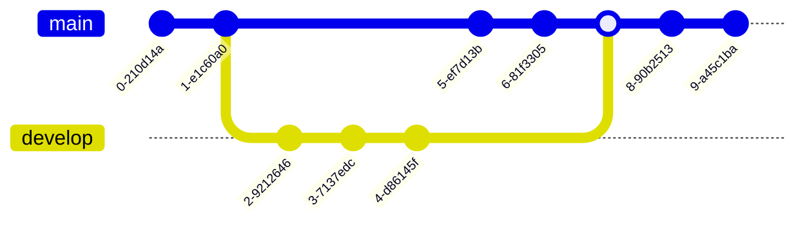

# Git Advanced Memo

## How does Git work?



Know Git is useful is important, but knowing why Git is useful is more important!

If you are a green hand for git, just ignore this section and find other git tutorial!



This section will be done in the near future.

Relevant Website: [Missing Semester for Git](https://missing.csail.mit.edu/2020/version-control/)

> For simplicity (My English is poor, and I want to explain the idea and the philosophy more clearly), I will use Chinese in this section.

**Git 的版本控制哲学**

Two topics:

- Content-Addressable Storage
- Delta Compression

### Problems

传统的线性历史版本控制（例如 `history_{time_stamp}`）简单，但是有很大的缺陷：

- **并行开发高度困难**，而并行开发是提升开发效率的瓶颈之一，无论是用于多人合作开发还是不同 feature & bugs 之间的隔离，简单的 Linear Sequence 无法完成这一点。

- **缺乏安全性**：在复杂的代码协作中，代码极有可能会被恶意篡改。

- **数据冗余**：这是任何一个历史备份功能都需要 tradeoff 的问题，很显然，naive的线性历史记录管理存在大量重复的代码和数据冗余。

Git 的出现，完美的解决了上述的三个问题。

### Content-Addressable Storage 内容寻址存储

#### Hash Function, SHA-1, SHA-256

哈希函数的精髓在于**有损压缩**。即将一个极大定义域空间通过一个映射压缩到一个有限的值域空间内部。从理论上分析，哈希函数不可能是一个单射（鸽子洞原理，这可以被证明），但是我们希望**哈希函数尽可能做到不存在哈希碰撞的情况出现**，实际上，这已经能够做到了。

`SHA-1`[^2] 和 `SHA-256` 都是**安全哈希算法**的一部分，可以将任何长度的数据，通过不可逆的数学运算转换成一个固定长度的字符串。安全哈希算法的雪崩效应保证了其不可逆性和抗碰撞性。有关 SHA-1 和 SHA-256 的具体计算方法在此处不展开。

> 2017年，谷歌团队通过优化算法，并利用巨大的计算资源（相当于6500年的单CPU计算时间和110年的单GPU计算时间），成功地创建了两个具有相同 SHA-1 哈希值的不同 PDF 文件。

SHA-256 的安全性更高，理论抗碰撞性是 $2^{128}$。

总之，我们只需了解：**SHA-256 能将任意长度的输入数据，生成一个256位（32字节）的哈希值**。

#### File Abstractions

对于任何一个文件夹中的文件`file`，可以看做是一串编码好的字符串，因此可以使用上文提到的哈希算法生成一个独一无二的 SHA-256 作为统一化的身份凭证，用于安全保护和存储管理。

因此，Git 对文件和文件夹做了一层高阶的抽象，这也是 Git 解决上述三个问题的第一个法宝：

> 在Linux中，文件夹本身也会被抽象成一种文件 (一切皆文件)

- 文件在 Git 中被称为 `blob`, `type blob = {file-string, SHA-string}`. `file-string` 是本身的文件内容。SHA-string 是加密后的哈希字符串。

> `SHA-string` 本质上就是一个 string，为了方便区分，单独写成这个名字。
> Git 实际上还会存储文件权限的变化，理论上就是向结构体里加东西，这里为了简化不考虑这一点

- 文件夹在 Git 中被称为 `tree`, `type tree = {map<tree | blob>}` or we can say is a list of `List[{type, hash, name}]`:
  - type: `blob` or `tree`
  - hash: `SHA-string`
  - name: name for the folders and the files
  - The key of the map is file_name, and the value is the three other things
  - 文件夹本身（当前的根目录文件夹）也会根据当前 tree 字段生成一个哈希值，作为递归的设计，回到顶层的root folder，最终项目的所有文件都会被抽象为一个顶层的tree，这个 tree 有一个哈希值。

- 一次提交也会被 Git 所抽象为 `commit`：

  - `parents`: The previous commit's SHA value
  - `author`: info message
  - `message`: commit message (for info)
  - `snapshot`: a tree (actually the SHA value of the tree)，因此创建一个新的快照对存储空间的消耗非常小。

最终，`blob`, `tree` 和 `commit` 都会被抽象化为一个 `object`，每一个object都有一个唯一的 SHA 凭证，这也是 File Abstraction 的关键所在。

$$\text{object} = \{ \text{blob}, \text{tree}, \text{commit} \} = \text{map}<\text{content string}, \text{SHA string} >$$

**任何对象都有一个哈希值！！！**：哈希值在 Git 中至关重要，一方面是为了保证安全性，任何对代码文件的隐秘修改都是不被允许的。同时，为了access到原本文件的内容，哈希值也作为指针，凭借这个唯一的凭证可以在 `.git/objects/` 目录下找到对应的不同文件的不同版本。这也就是**内容寻址存储**的精髓，“址”就是所谓的独一无二的哈希值，在目录中找到对应文件夹的索引就是寻找内容的过程。

#### How this work?

2/3：安全性 & 存储效率

- 安全性的角度：任何对代码文件的微小修改都会导致对应文件及其上游封装的哈希值的变化，例如，几乎没有办法通过强制修改历史记录或者哈希值的方法实现历史记录的恶意篡改。

- 存储效率的角度：当文件内容未发生变化时，对应的哈希值不会发生变化，**git 把历史记录的存储粒度从版本级控制降低到文件级**，即**任何一个文件的任何一次版本修改**都会被单独记录为一个哈希索引。这极大地优化的存储空间的浪费问题（对于代码修改而言，每一次的修改都只是针对几个特定的代码文件，有大量的未被修改的文件被存储了多次，造成了空间浪费）

> 实际上 Git 对存储空间的压缩不止与此，后续会继续深入探索 Git 的垃圾回收机制。

### Directed Acyclic Graph 有向无环图

为了解决并行开发的设置，Git在设置文件抽象的基础之上大胆地在**线性的历史顺序**上做出创新。

Linear History

Parallel History

为了达成这样的并行结果，Git将每一个commit抽象成了一个节点，对于整个项目的历史使用一个有向无环图来存储这样若干个节点。

在一般情况下，一个节点的出度为1，入度也为1，每一个节点会指向他的父节点，代表上一个历史状态**父提交**（哈希值在此处发挥了指针的作用）。不过也有例外：

- 一个节点的入度可以为2,3，甚至更大，这代表着**新分支的创建**

- 一个节点的出度可以为2，这代表着**两个分支的合并**。



Git 的核心哲学是历史一旦创建，就不可更改。每个提交（Commit）的哈希值是根据其所有内容计算出来的，这包括：

- 根 Tree 对象的哈希值：代表了项目在那个时间点的完整目录和文件快照。

- 作者、提交者、时间戳、提交信息。

- **父提交的哈希值**。因为一个 Commit 的哈希值依赖于其父 Commit 的哈希值，这就在历史记录中创建了一个强大的加密信任链。

如果一个 Commit 指向其子 Commit：那么当新的提交产生时，所有旧的 Commit 都需要被修改，以更新它们的“子”指针。这个修改会导致旧 Commit 的内容发生变化，从而改变它们的哈希值。哈希值的改变会破坏整个历史哈希链，使得历史变得可变且不可信。

如果一个 Commit 指向其父 Commit：当你创建一个新的提交时，你只需要知道你当前所在提交的哈希值（也就是 HEAD）。新提交的内容中包含旧提交的哈希值。新提交有自己的哈希值，但它不会影响旧提交的哈希值。旧提交在创建之后，就永远不会被修改，其哈希值也不会改变。

结论：反向建模使得每一个提交都成为一个不可变的对象。Git 的历史不是一个可以修改的链表，而是一个只能在末尾追加的日志。



这就出色的解决了传统的历史记录管理过程中**并行开发难度大的问题**。

### Delta Compression

Git 的 Delta Compression（增量压缩）是一种强大的存储优化机制，它的主要目的是在不牺牲 Git 核心功能的前提下，极大地节省磁盘空间。Git 的内容寻址存储（Content-Addressable Storage）模型意味着每一个文件的每一次细微改动都会创建一个新的 Blob 对象。如果没有增量压缩，一个经常修改的文本文件（比如 `README.md`）可能会迅速消耗大量空间，因为每次提交都会存储一个完整的、全新的文件快照。增量压缩正是为了解决这个问题而设计的。它将存储的单位从完整的“文件版本”转变为“文件差异”。

这个过程不会在每次提交时都发生，而是在 Git 进行**后台优化**时执行。它通常分为两个阶段：

#### 阶段一：松散对象（Loose Objects）

当你执行 `git add` 和 `git commit` 时，Git 会将每个新对象（文件、目录、提交等）单独存储为一个压缩的“松散对象”（loose object）。每一个独立的压缩文件是为了提高 Git 提交的速度。

#### 阶段二：打包文件（Packfiles）

当松散对象的数量达到一定阈值，或者你手动运行 `git gc`（垃圾回收）命令时，Git 就会启动优化机制，将这些松散对象打包（pack）到一个或多个大型文件，即 `packfile`。

在打包过程中，Git 会进行增量压缩：

1.  **相似对象识别**：Git 会智能地识别出内容相似的对象，通常是同一个文件的不同版本。
2.  **基础对象选择**：它会选择其中一个版本作为**基础对象（base object）**，并将其完整存储。
3.  **差异计算**：对于其他相似的版本，Git 会计算它们与基础版本之间的**二进制差异**，并存储这些差异指令（delta）。这些差异通常比完整的文件内容小得多。

最终，`packfile` 中存储的是一个完整的基础对象，以及多个指向它的、包含差异指令的“Delta 对象”。



增量压缩是一种**用读取时间换取存储空间**的策略。

* **存储空间**：它通过存储差异，极大地减小了 Git 仓库的体积，尤其是在包含大量小改动历史的项目中。
* **读取速度**：在需要读取一个被增量压缩过的文件时，Git 需要先找到基础对象，然后逐步应用所有的差异指令，才能重构出完整的文件。这个过程比直接读取一个完整的松散对象要慢。

Git 很好地平衡了这种权衡，通过在后台自动进行优化，使得提交速度快，而仓库的长期存储效率又很高。



### The Whole Pipeline

下面介绍在简单的 `add & commit` 的过程中，Git 后台发生了什么：

- `git add file`

  * **计算哈希值**：Git 会读取 `<file>` 的内容，计算其 SHA-1 哈希值。这个哈希值是内容的唯一标识。
  * **创建 Blob 对象**：如果暂存区中还没有这个内容哈希值的对象，Git 会将文件内容压缩并存储为一个 **Blob 对象** 在 `.git/objects/` 目录下。这个 Blob 对象的名称就是其内容的 SHA-1 哈希值。
  * **更新暂存区**：Git 会在暂存区（也叫索引，`.git/index` 文件）中记录这个文件路径、其权限以及对应的 Blob 对象的哈希值。如果一个文件的内容在多次 `git add` 之间没有变化，Git 会发现其内容哈希值与已有的 Blob 对象相同，于是不会创建新的对象，只是更新暂存区中的记录。

- `git commit`：创建 Tree 对象

  * **遍历暂存区**：Git 会遍历暂存区中的所有文件和目录信息。
  * **创建 Tree 对象**：Git 会根据暂存区中的文件和目录结构，递归地创建 **Tree 对象**。
      * 一个 Tree 对象代表一个目录。它包含了该目录下所有文件（Blob 对象）和子目录（其他 Tree 对象）的列表。
      * 每个 Tree 对象都记录了其下所有内容的哈希值、类型（blob 或 tree）、文件名和权限。
  * **创建根 Tree 对象**：最终，Git 会为项目的根目录创建一个唯一的 Tree 对象。这个根 Tree 对象就代表了整个项目在那个时间点的完整目录结构和文件内容。

- 创建 Commit 对象
    * **`tree`**：一个指向你在上一步创建的根 Tree 对象的哈希值。这是快照的核心，它将整个项目的文件和目录结构与内容联系起来。
    * **`parent`**：一个或多个指向当前分支上一个或多个父 Commit 对象的哈希值。这构成了 Git 的历史记录链。普通提交有一个父提交，合并提交有两个或更多的父提交。
    * **`author`**：提交者的姓名和邮箱，以及提交时间。
    * **`committer`**：提交操作者的姓名和邮箱，以及提交时间。
    * **`message`**：提交时输入的日志信息。

-  **更新分支指针**：最后，Git 会将当前分支（例如 `master` 或 `main`）的指针（`.git/refs/heads/<branch_name>`）更新为新创建的 Commit 对象的哈希值。至此，一个commit被正式纳入历史记录中。

## Quick Memo for Git command

Recommend this blog[^1] for knowing more Git command.

- File movement/transfer between the Working Directory and the Staging Area.

  - `git add <file_name>`: Add files from **Working Directory** to **Staging**.

  - `git reset HEAD <file_name>` or `git restore --staged <file_name>`: Remove files from **Staging** to **Working Directory**.

- File movement between the Staging Area and the Local Repo.

  - `git commit -m <message>`: Commit file from **Staging** to **Local Repo**.

  - `git reset --soft HEAD~1`: Remove the latest commit from **Local Repo** to **Staging Area**.

    - `git reset --mixed HEAD~1`: Remove directly to the current working directory.

- File movement between **remote branch tracking** and **remote branch**:

  - `git fetch`: Fetching new updated to Remote branch tracking.

- `git pull`: Pulling files from **Remote Repo** to **Current Working Directory**.

  - First, `git fetch`.

  - Then, `git merge`, for example, merge branch `origin/main` into `main`.

- `git push`: Pushing files from **Local Repo** to **Remote Repo**.

- `git stash`: Stash from **Working Directory** to **Stash Locations**.

    - `git stash pop`: Get stash from **stash locations** to **working directory**.

    - `git stash list`: List all the stash.

- `git merge` & `git rebase`

  - Git Merge: Integrate all the commits of one branch into another.

    - `git merge <branch>`: merge branch into current branch. (Fast Forward Merge & 3-Way Merge)

    - `git rebase <branch>`: rewrite history for branch, to rewrite history.

      - Never Use `git rebase` in `main` branch or other public branches!



| Command | Moves HEAD | Modifies Staging Area | Modifies Working Directory | Common Use Case |
|:--- |:--- |:--- |:--- |:--- |
| `git reset --soft` | Yes | No | No | Undoes commits but keeps all changes in the staging area, ready to be re-committed. |
| `git reset --mixed` | Yes | Yes | No | Undoes commits and unstages changes, moving them to the working directory. |
| `git reset --hard` | Yes | Yes | Yes | Completely discards commits and all local changes, reverting to a previous version. |







## References

[^1]: [图解 Git 命令](https://marklodato.github.io/visual-git-guide/index-zh-cn.html)

[^2]: [SHA-1](https://zh.wikipedia.org/wiki/SHA-1)
